---
## Front matter
lang: ru-RU
title: Лабораторная работа №3
subtitle: Сетевые технологии
author:
  - Ищенко Ирина НПИбд-02-22
institute:
  - Российский университет дружбы народов, Москва, Россия

## i18n babel
babel-lang: russian
babel-otherlangs: english

## Formatting pdf
toc: false
toc-title: Содержание
slide_level: 2
aspectratio: 169
section-titles: true
theme: metropolis
header-includes:
 - \metroset{progressbar=frametitle,sectionpage=progressbar,numbering=fraction}
---

# Цель работы

Изучение посредством Wireshark кадров Ethernet, анализ PDU протоколов транспортного и прикладного уровней стека TCP/IP.

# Выполнение лабораторной работы

##

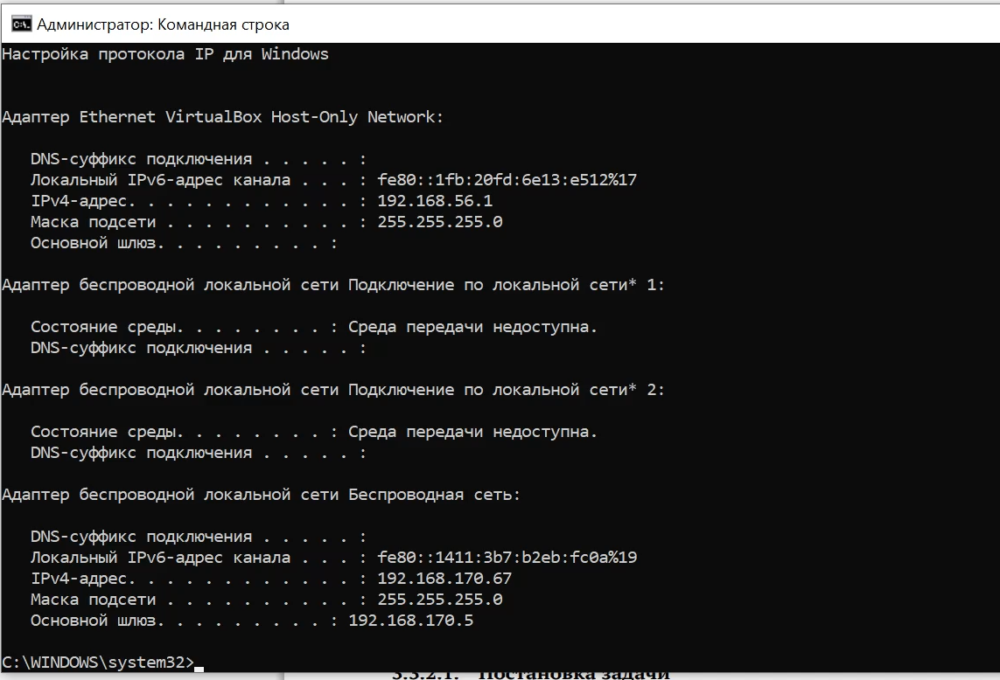{#fig:001 width=70%}

##

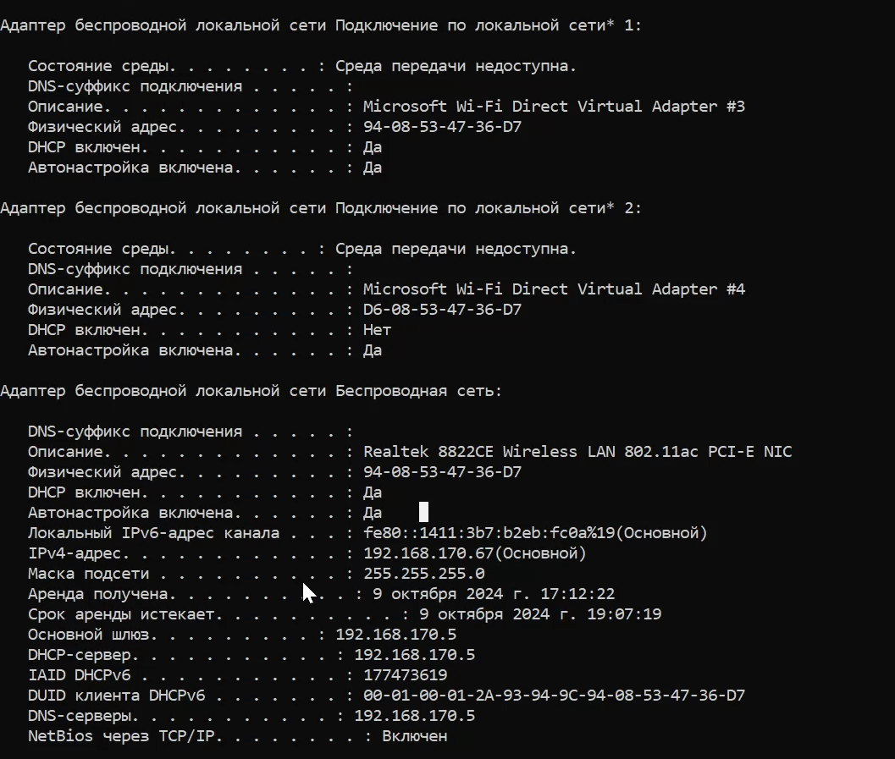{#fig:002 width=70%}

##

{#fig:003 width=70%}

##

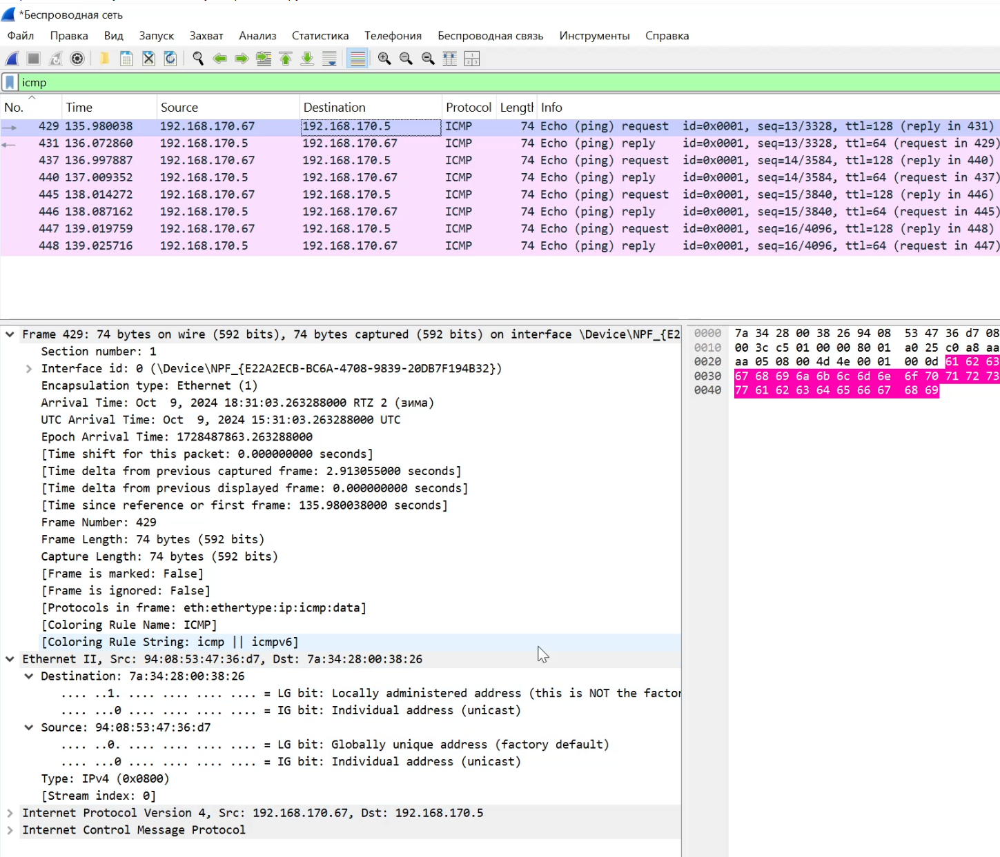{#fig:004 width=70%}

##

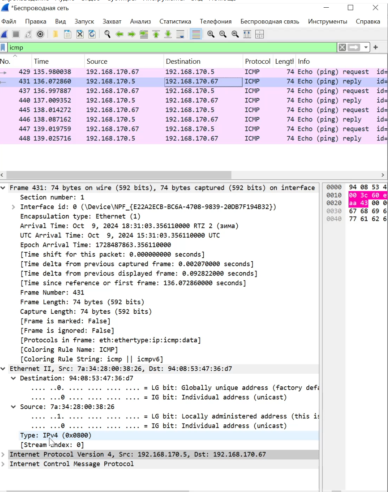{#fig:005 width=70%}

##

{#fig:006 width=70%}

##

{#fig:007 width=70%}

##

{#fig:008 width=70%}

##

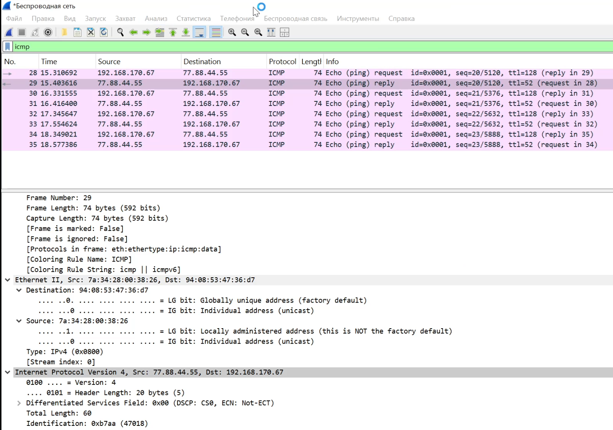{#fig:009 width=70%}

##

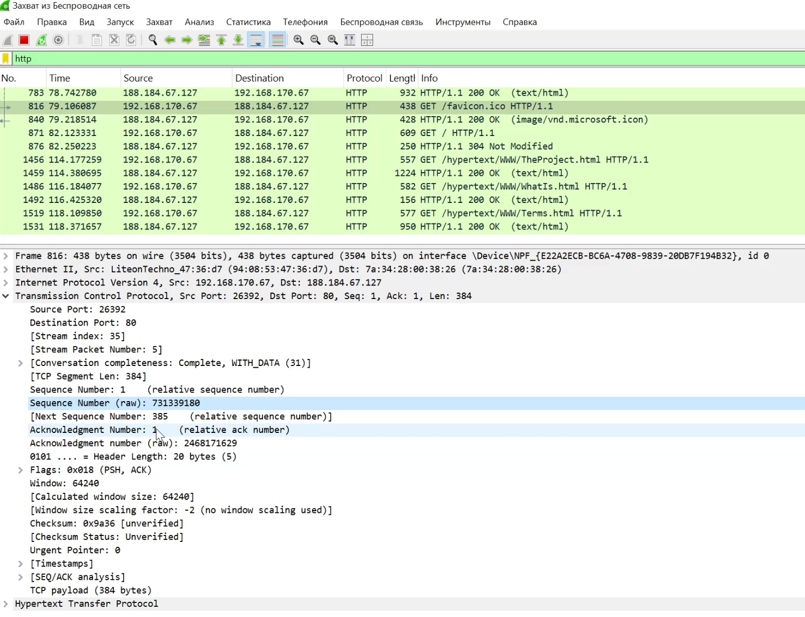{#fig:0010 width=70%}

##

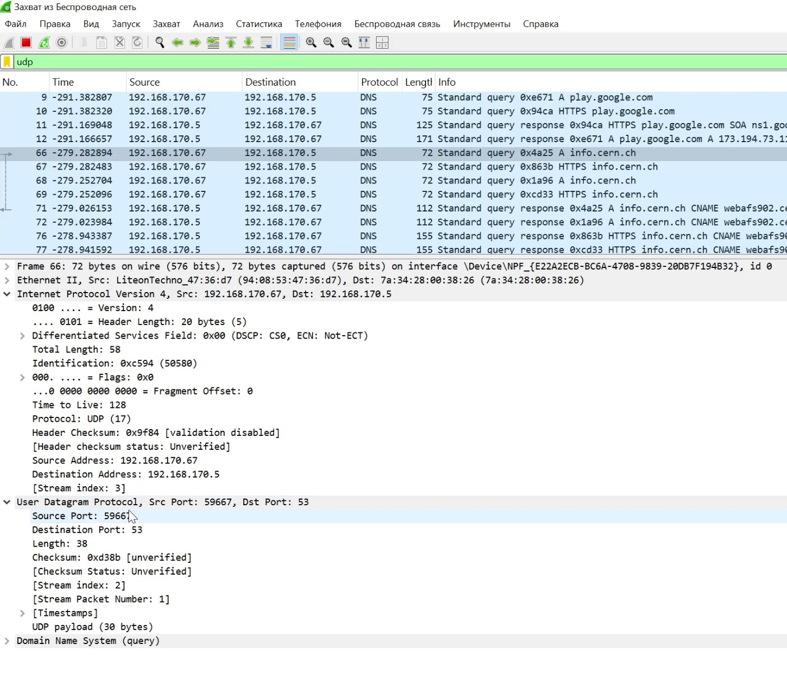{#fig:0011 width=70%}

##

{#fig:0012 width=70%}

##

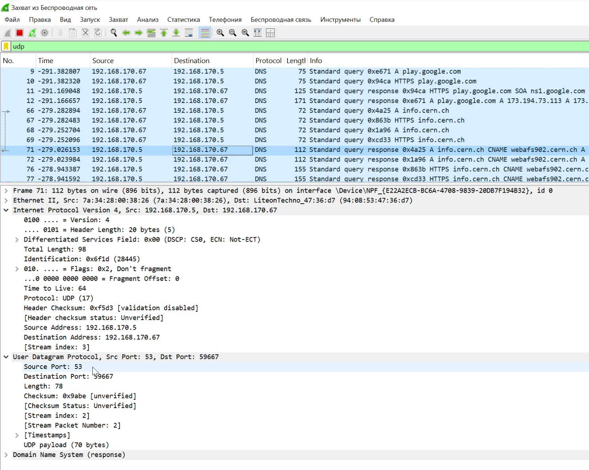{#fig:0013 width=70%}

##

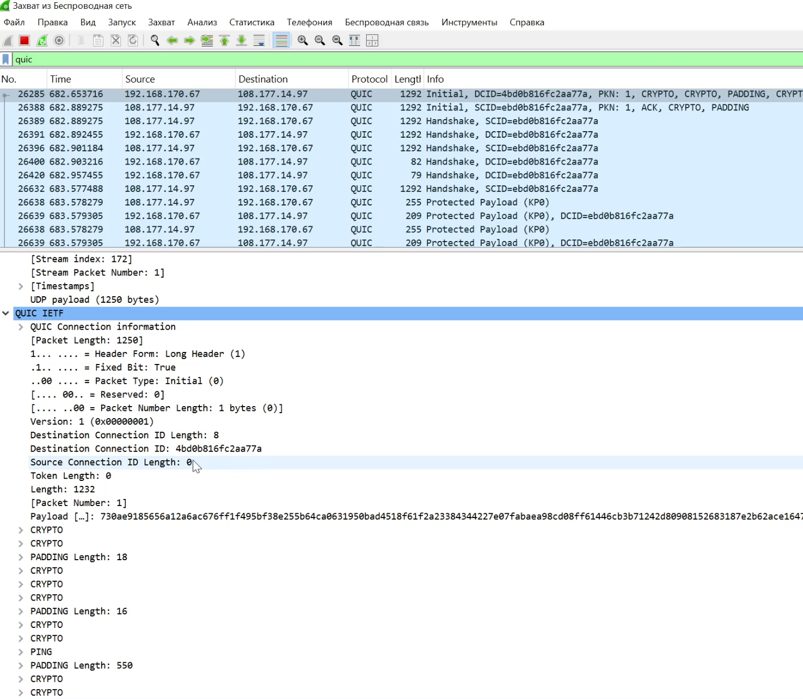{#fig:0014 width=70%}

##

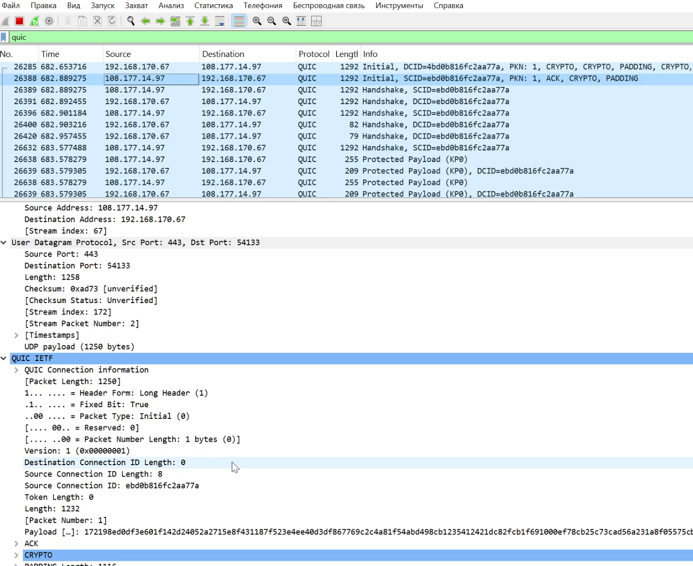{#fig:0015 width=70%}

##

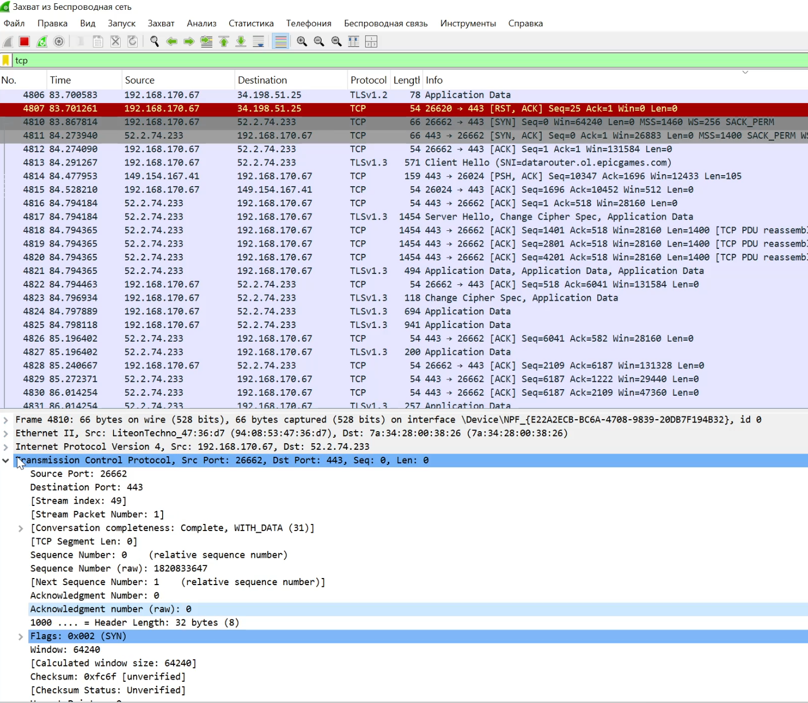{#fig:0016 width=70%}

##

{#fig:0017 width=70%}

##

{#fig:0018 width=70%}

##

{#fig:0019 width=70%}

## Выводы

В ходе лабораторной работы я изучила посредством Wireshark кадры Ethernet, анализ PDU протоколов транспортного и прикладного уровней стека TCP/IP.

