---
## Front matter
title: "Отчёт по лабораторной работе №3"
subtitle: "Сетевые технологии"
author: "Ищенко Ирина НПИбд-02-22"

## Generic otions
lang: ru-RU
toc-title: "Содержание"

## Bibliography
bibliography: bib/cite.bib
csl: pandoc/csl/gost-r-7-0-5-2008-numeric.csl

## Pdf output format
toc: true # Table of contents
toc-depth: 2
lof: true # List of figures
lot: true # List of tables
fontsize: 12pt
linestretch: 1.5
papersize: a4
documentclass: scrreprt
## I18n polyglossia
polyglossia-lang:
  name: russian
  options:
	- spelling=modern
	- babelshorthands=true
polyglossia-otherlangs:
  name: english
## I18n babel
babel-lang: russian
babel-otherlangs: english
## Fonts
mainfont: IBM Plex Serif
romanfont: IBM Plex Serif
sansfont: IBM Plex Sans
monofont: IBM Plex Mono
mathfont: STIX Two Math
mainfontoptions: Ligatures=Common,Ligatures=TeX,Scale=0.94
romanfontoptions: Ligatures=Common,Ligatures=TeX,Scale=0.94
sansfontoptions: Ligatures=Common,Ligatures=TeX,Scale=MatchLowercase,Scale=0.94
monofontoptions: Scale=MatchLowercase,Scale=0.94,FakeStretch=0.9
mathfontoptions:
## Biblatex
biblatex: true
biblio-style: "gost-numeric"
biblatexoptions:
  - parentracker=true
  - backend=biber
  - hyperref=auto
  - language=auto
  - autolang=other*
  - citestyle=gost-numeric
## Pandoc-crossref LaTeX customization
figureTitle: "Рис."
tableTitle: "Таблица"
listingTitle: "Листинг"
lofTitle: "Список иллюстраций"
lotTitle: "Список таблиц"
lolTitle: "Листинги"
## Misc options
indent: true
header-includes:
  - \usepackage{indentfirst}
  - \usepackage{float} # keep figures where there are in the text
  - \floatplacement{figure}{H} # keep figures where there are in the text
---

# Цель работы

Изучение посредством Wireshark кадров Ethernet, анализ PDU протоколов транспортного и прикладного уровней стека TCP/IP.

# Выполнение лабораторной работы

С помощью команды ipconfig для ОС типа Windows выведем 
информацию о текущем сетевом соединении. Отсюда 
мы можем узнать IPv6-адрес, IPv4-адрес (уникальный IPv4-адрес узла), маску
подсети (используется для определения сетевой и узловой частей IPv4-адреса)
и шлюз (рис. [-@fig:001]).

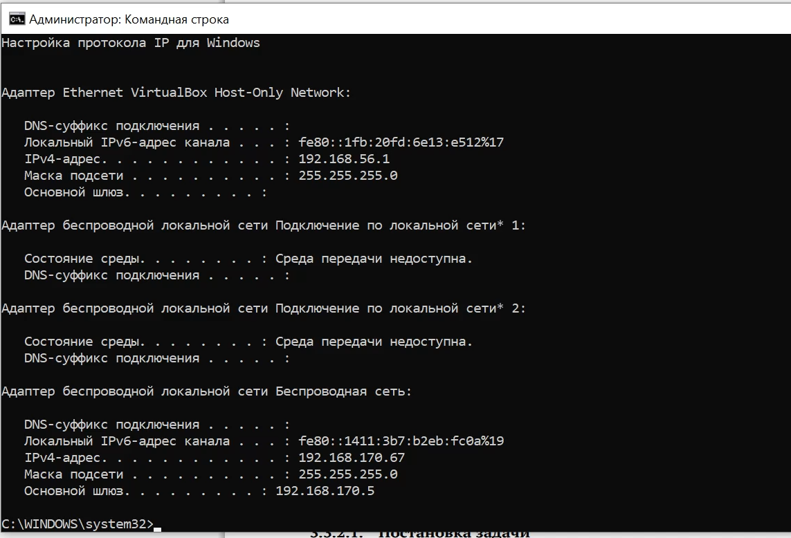{#fig:001 width=70%}

Используем также опцию /all для вывода более подробной информации. 
Определим MAC-адреса сетевых интерфейсов на моем компьютере (рис. [-@fig:002]). 
У меня есть помимо основной беспроводной сети WI-FI еще две 
локальные сети - виртуальные. MAC-адрес для первого 
виртуального адаптера: 94-08-53-47-36-D7. MAC-адрес состоит из 6 октетов: 
первые 3 октета идентифицируют производителя, последние 3 октета 
идентифицируют сетевой интерфейс. Разберем первый байт MAC-адреса (94), 
переведем в двоичный код 94 = 10010100. Нас интересуют последние два бита 
(нулевой и первый биты). У меня оба нули => мой адрес индивидуальный и 
глобально администрируемый.

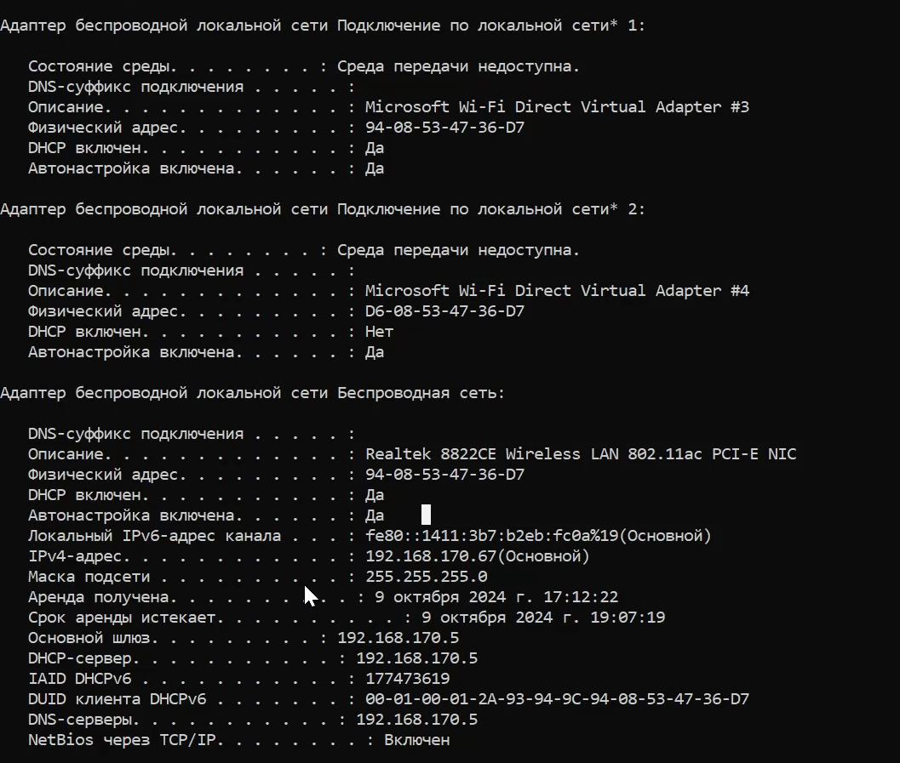{#fig:002 width=70%}

MAC-адрес для второго виртуального адаптера: D6-08-53-47-36-D7.
Переводим первый байт в двоичный код D6 = 11010110. Этот адрес является 
индивидуальным и локально администрируемым (поэтому по нему нельзя
узнать производителя).

MAC-адрес для беспроводной сети WI-FI: 94-08-53-43-36-D7. 
Переводим первый байт в двоичный код 94 = 10010100. Этот адрес является 
индивидуальным и глобально администрируемым (производитель Liteon Technology Corporation).

Из предыдущего задания мы узнали адрес основного шлюза: 192.168.170.5.
Теперь пропингуем его (рис. [-@fig:003]), предварительно запустив Wireshark и включив захват 
трафика. Посылаются 4 пакета, 4 пакета получено назад.

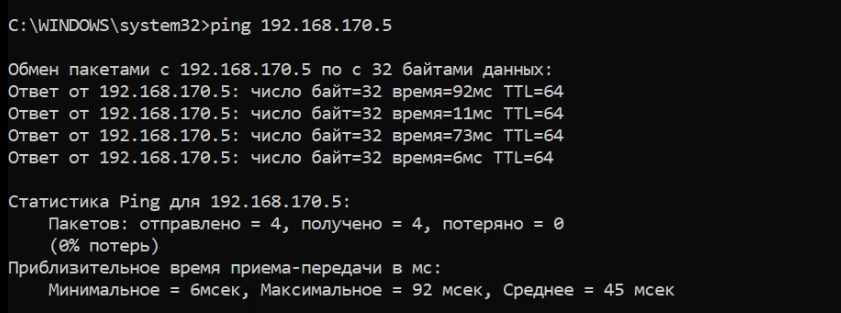{#fig:003 width=70%}

В строке фильтра пропишем фильтр icmp. Убедимся, что в списке 
пакетов отобразятся только пакеты ICMP, в частности пакеты, которые были 
сгенерированы с помощью команды ping, отправленной с моего устройства на 
шлюз по умолчанию.
Изучим эхо-запрос (рис. [-@fig:004]) и эхо-ответ ICMP (рис. [-@fig:005]) в программе Wireshark:
На панели списка пакетов (верхний раздел) выберем первый указанный
кадр ICMP — эхо-запрос. Изучим информацию на панели сведений о пакете в 
средней части экрана. На вкладке физического уровня можно найти длину 
кадра (74 бита), тип Ethernet – Ethernet (1).

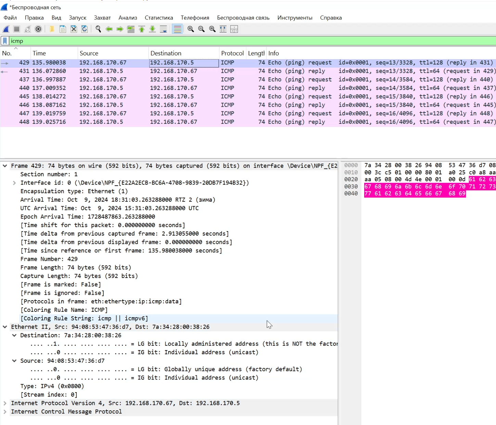{#fig:004 width=70%}

Чтобы узнать MAC-адрес источника и шлюза перейдем на канальный 
уровень. Адрес источника (Source, откуда запрос отправлен) – это адрес моего 
устройства (94-08-53-43-36-D7). Адрес шлюза (destination, то куда отправлен 
запрос) - 7A-34-28-00-38-26. Тип адреса тут указан (показаны нулевые и 
первые биты MAC-адресов). Адрес источника индивидуальный и глобально администрируемый, адрес шлюза индивидуальный и локально администрируемый.
Далее посмотрим на полученный ответ. Тут все почти то же самое, что и 
в запросе (длина кадра 74 бита). Только теперь MAC-адрес источника - MAC-адрес шлюза (7A-34-28-00-38-26), а адрес назначения – адрес моего 
устройства (94-08-53-43-36-D7).

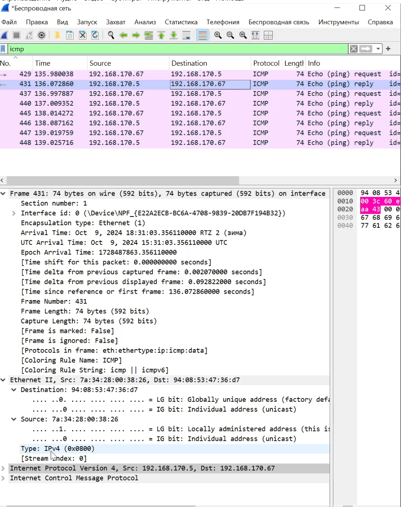{#fig:005 width=70%}

Изучим кадры данных протокола ARP (рис. [-@fig:006]). Hardware type – это адрес
канального уровня (Ethernet (1)), Protocol type – сетевой уровень (протокол 
IPv4), далее указаны размеры MAC-адреса (6 байт) и размер IPv4-адреса (4 
байта). Код запроса – 1.
Изучим данные в полях заголовка Ethernet II.
Здесь указаны MAC-адреса источника и получателя. Получатель в 
нашем случае – индивидуальный и локально администрируемый адрес. Источник – адрес нашего шлюза (индивидуальный и глобально администрируемый).

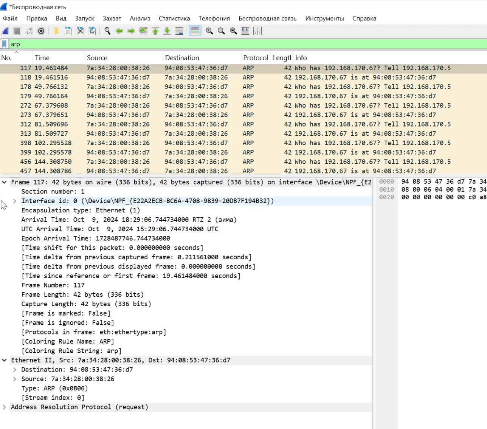{#fig:006 width=70%}

Начнем новый процесс захвата трафика в Wireshark. Пропингуем сайт яндекса (рис. [-@fig:007]).
Изучим запрос протокола ICMP (рис. [-@fig:008]). Адрес источника (Source, откуда запрос 
отправлен) – это адрес моего устройства (94-08-53-43-36-D7) - индивидуальный и глобально 
администрируемый. Адрес получателя (destination, то куда отправлен запрос) - 7A-34-28-00-38-26 - индивидуальный и локальный администрируемый.

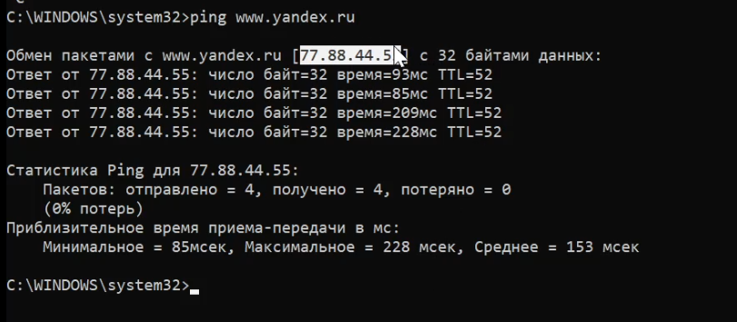{#fig:007 width=70%}

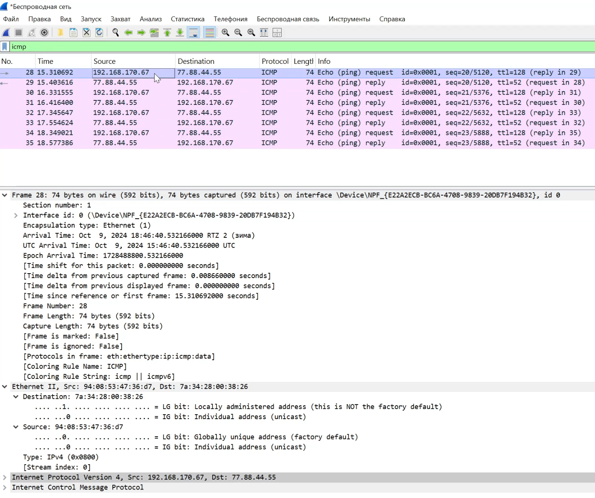{#fig:008 width=70%}

Изучим запрос протокола ICMP (рис. [-@fig:009]). Адрес источника (Source, то куда откуда
запрос отправлен) - 7A-34-28-00-38-26. Адрес получателя (Destination, то куда 
отправлен запрос) – это адрес моего устройства (94-08-53-43-36-D7). 

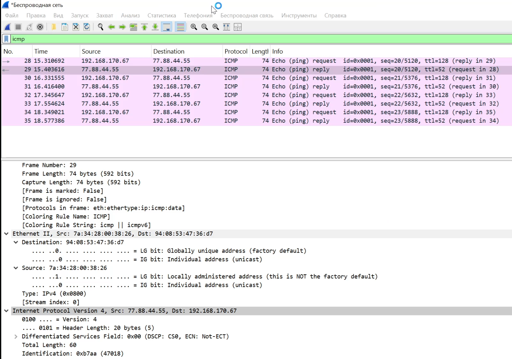{#fig:009 width=70%}

В браузере перейдем на сайт, работающий по протоколу HTTP 
(например, на сайт CERN http://info.cern.ch/). Для получения большей 
информации для Wireshark поперемещались по ссылкам или разделам сайта в 
браузере. 
В Wireshark в строке фильтра укажем http и проанализируем
информацию по протоколу TCP в случае запросов (рис. [-@fig:0010]) и ответов (рис. [-@fig:0012]). 
Открываем раздел протокола TCP в случае запроса. Видим, что порт 
получателя – 80 (это стандартный порт для http). Порт источника - 26392 (он 
определяется случайным образом из незанятых и непривилегированных
портов). Также тут есть поле Порядковый номер (Sequence Number) и поле 
Номер подтверждения (Acknowledgment Number).

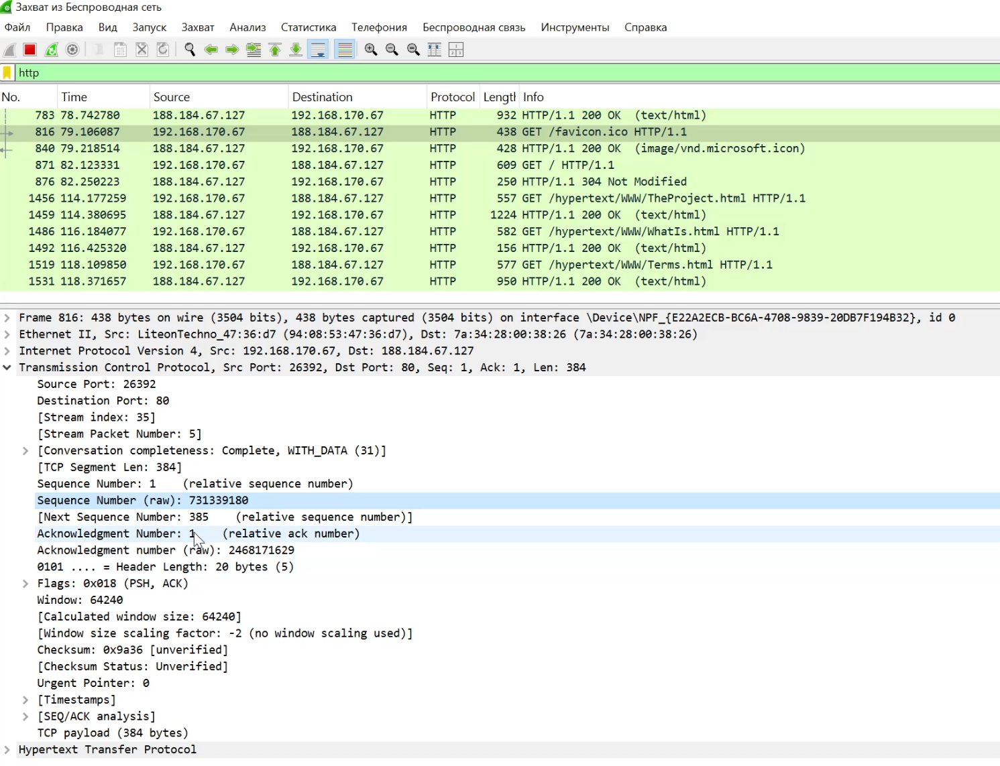{#fig:0010 width=70%}

Далее рассмотрим ответ. Здесь у нас поменялись местами порты источника и 
получателя. Теперь порт источника – порт сайта (80). А порт получателя - 26392 
(выбранный случайным образом).
В Wireshark в строке фильтра укажем dns и проанализируем
информацию по протоколу UDP в случае запросов и ответов.
В случае запроса (рис. [-@fig:0011]): порт источника – 59667 (выбранный случайным 
образом из незанятых и непривилегированных портов). Порт получателя - 53.

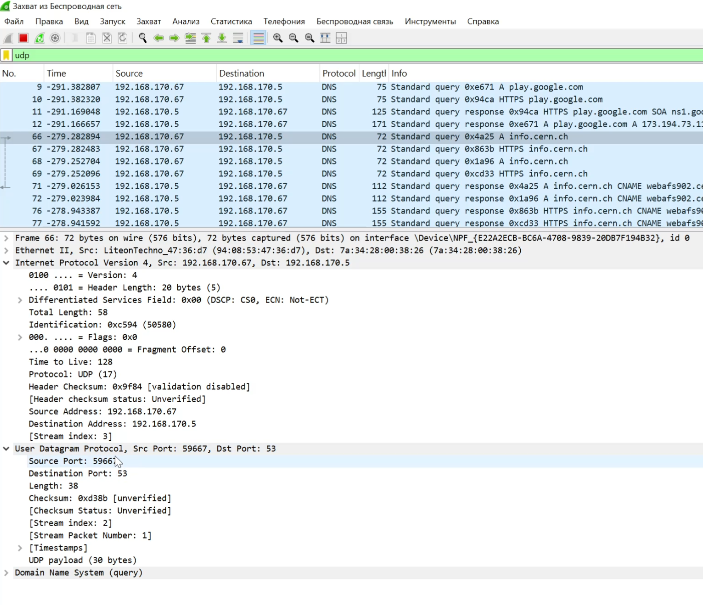{#fig:0011 width=70%}

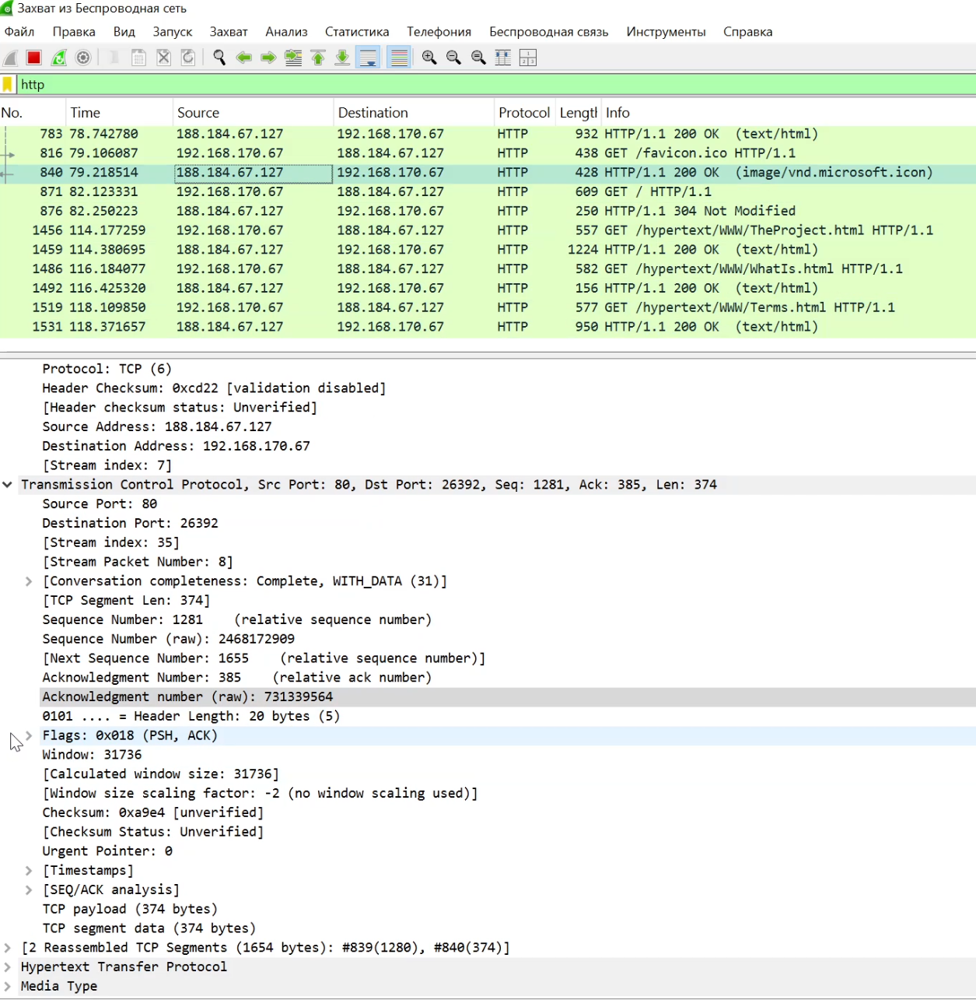{#fig:0012 width=70%}

В случае ответа (рис. [-@fig:0013]) порт источника - 53, а порт получателя - 59667.

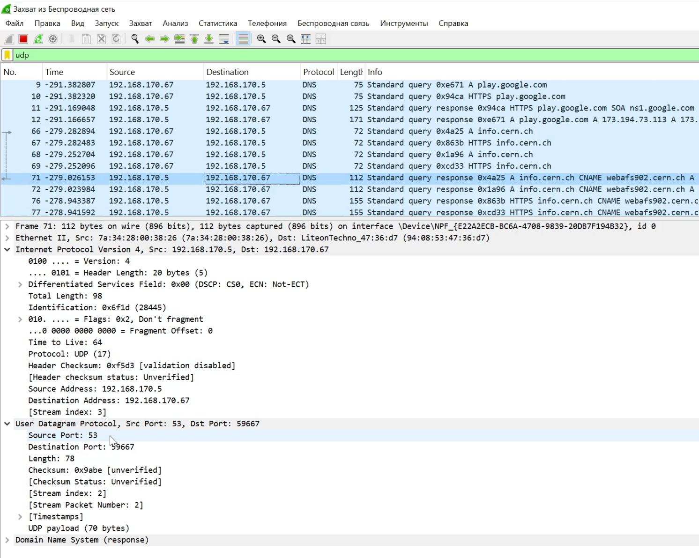{#fig:0013 width=70%}

В Wireshark в строке фильтра укажем quic и проанализируем
информацию по протоколу quic в случае запросов (рис. [-@fig:0014]) и ответов (рис. [-@fig:0015]).
Как и в случае dns можем посмотреть информацию транспортного 
уровня по протоколу UDP. Порт источника задан случайно, выбором из 
непривелигированных и незанятых портов, и равен 54133, порт получателя
равен 443 - это стандартный порт HTTPS, то есть quic сразу криптуется.
Для создания альтернативы TCP поверх UDP строятся протоколы 
прикладного уровня QUIC IETF, которые управляют трафиком, управляют 
качеством обслуживания.

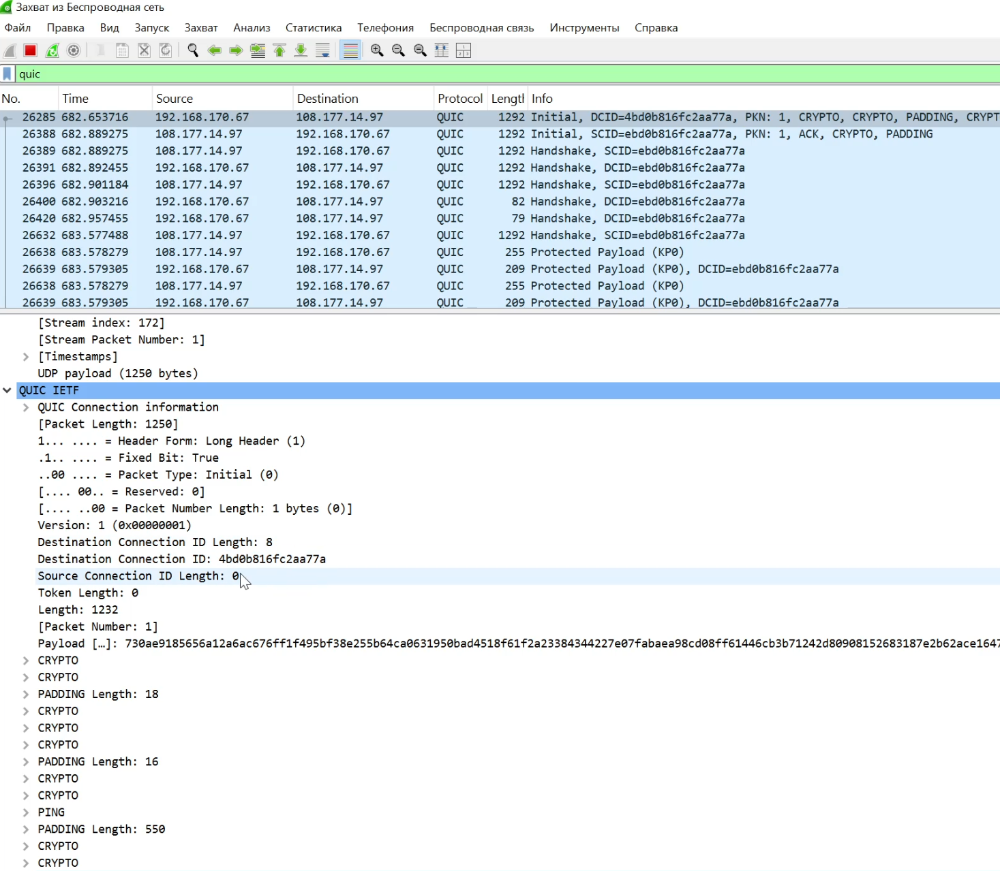{#fig:0014 width=70%}

В случае ответа порты заданы наоборот, то есть источник - 443 порт, получатель –
54133.

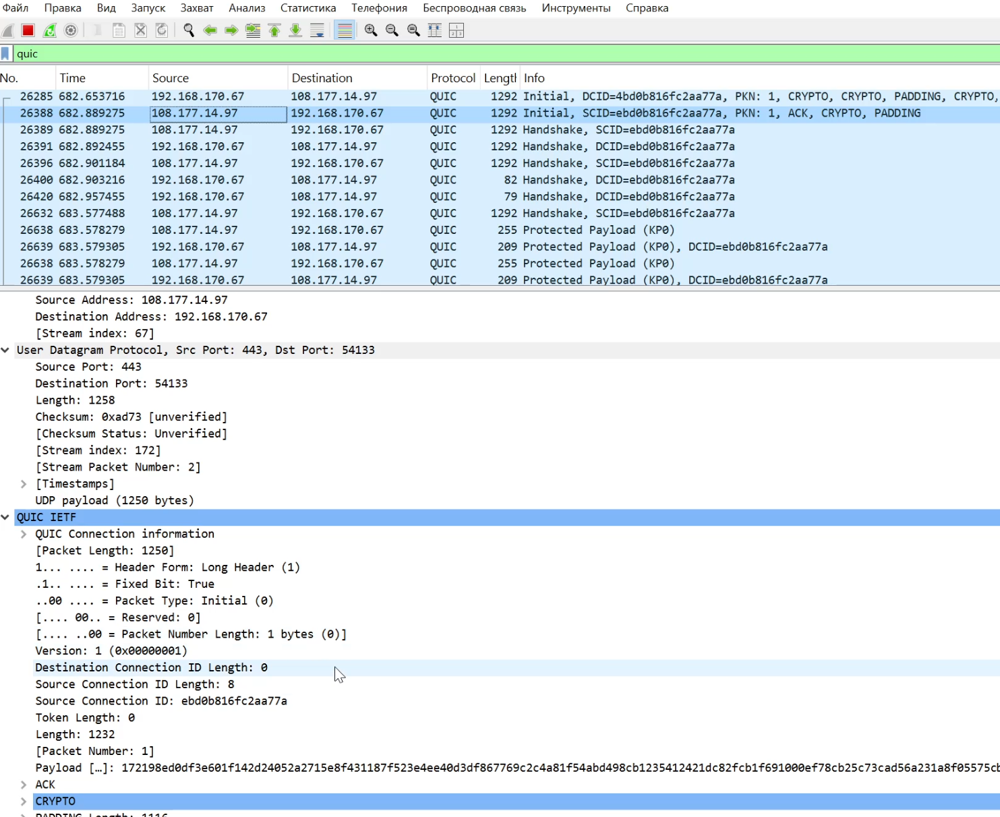{#fig:0015 width=70%}

На моем устройстве используем соединение по HTTP с каким-то сайтом для захвата 
в Wireshark пакетов TCP.
Проанализируем handshake протокола TCP. Режим активного доступа (Active Open) (рис. [-@fig:0016]). Клиент посылает сообщение SYN, ISSa, т.е. в передаваемом сообщении установлен бит SYN (Synchronize Sequence Number), а в поле 
Порядковый номер (Sequence Number) — начальное 32-битное значение ISSa (Initial
Sequence Number).
Значение Sequence Number равно 1820833647 (ISSa), значение Acknowledgment
Number равно 0. Также видим, что установлен флаг SYN.

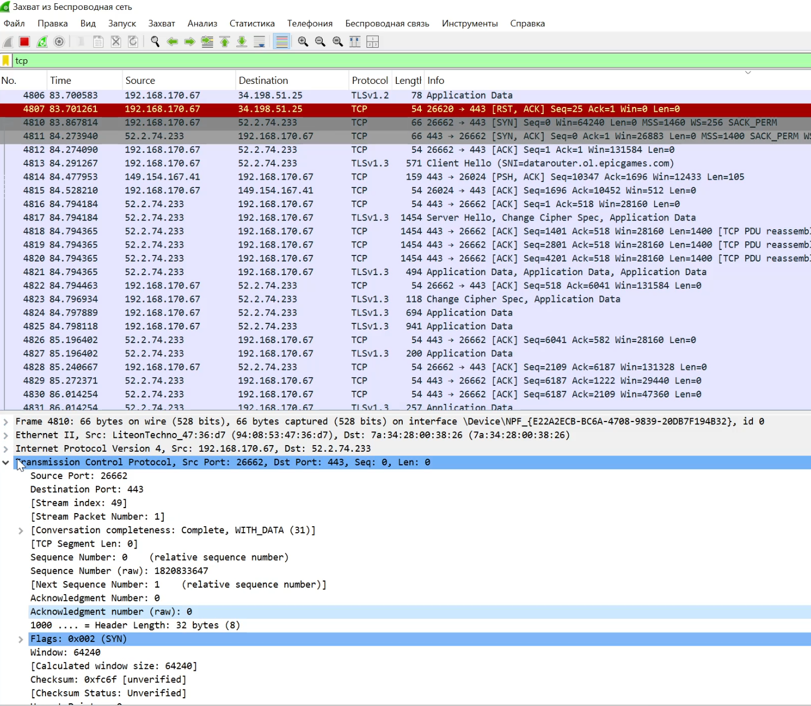{#fig:0016 width=70%}

Режим пассивного доступа (Passive Open) (рис. [-@fig:0017]). Сервер откликается, посылая сообщение 
SYN, ACK, ISSb, ACK(ISSa+1), т.е. установлены биты SYN и ACK; в поле Порядковый 
номер (Sequence Number) хостом B устанавливается начальное значение счётчика — ISSb; 
поле Номер подтверждения (Acknowledgment Number) содержит значение ISSa, полученное 
в первом пакете от хоста A и увеличенное на единицу.
Действительно, Acknowledgment Number равно 1820833647 (значение ISSa) + 1 =
1820833648. Sequence Number равен 492681311 (начальное значение счётчика — ISSb).
Установлены флаги SYN, ACK.

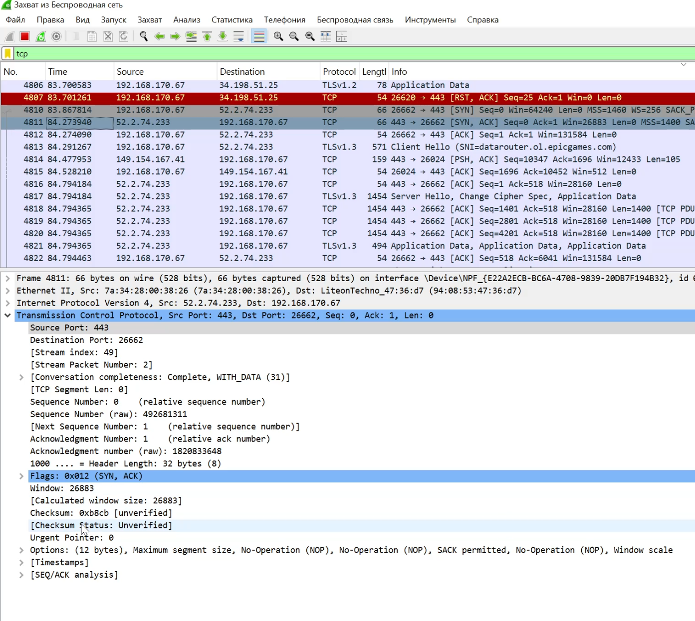{#fig:0017 width=70%}

Завершение рукопожатия (рис. [-@fig:0018]). Клиент отправляет подтверждение получения SYN
сегмента от сервера с идентификатором, равным ISN (сервера)+1: ACK, ISSa+1, 
ACK(ISSb+1). В этом пакете установлен бит ACK, поле Порядковый номер (Sequence 
Number) содержит ISSa+1, поле Номер подтверждения (Acknowledgment Number) содержит 
значение ISSb+1. Посылкой этого пакета заканчивается трёхступенчатый handshake, и TCP соединение считается установленным.
Действительно, Acknowledgment Number равно 492681311 (значение ISSb) + 1 =
492681312. Sequence Number равен 1820833647 (значение ISSa) + 1 =
1820833648. Установлен флаг ACK.

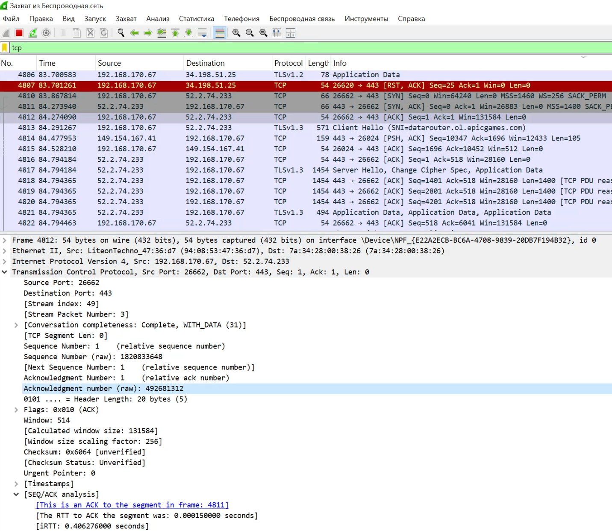{#fig:0018 width=70%}

Далее посмотрим график потока (рис. [-@fig:0019]). Здесь в принципе все то же самое, что мы уже 
разобрали, только на графике. Клиент посылает запрос серверу (установлен бит SYN), Seq
= 0. Далее сервер отвечает клиенту (установлены биты SYN, ACK), Seq = 0, Ack =1 (это 
относительные значения). Завершение рукопажатия: клиент отправляет серверу подтверждение получения SYN сегмента, Seq = 1, Ack = 1.

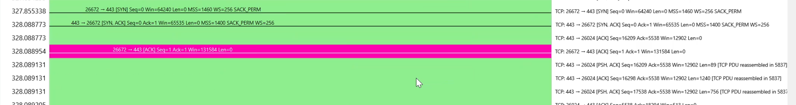{#fig:0019 width=70%}

# Выводы

В ходе лабораторной работы я изучила посредством Wireshark кадры Ethernet, анализ PDU протоколов транспортного и прикладного уровней стека TCP/IP.

