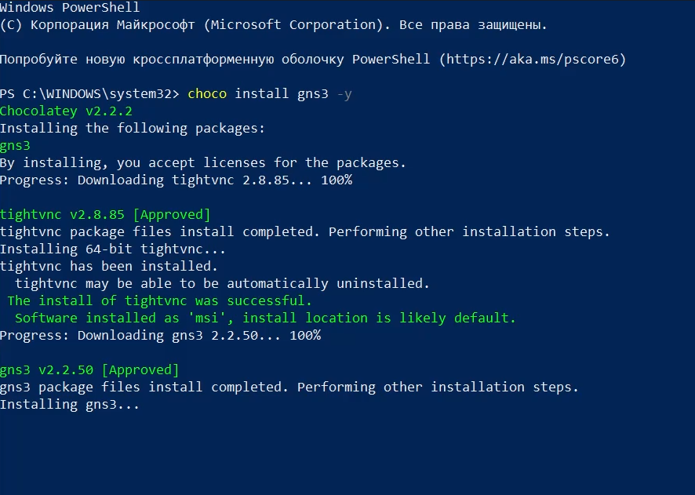
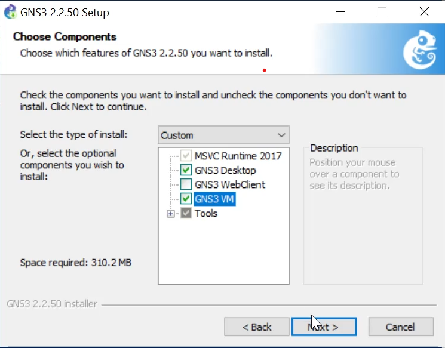
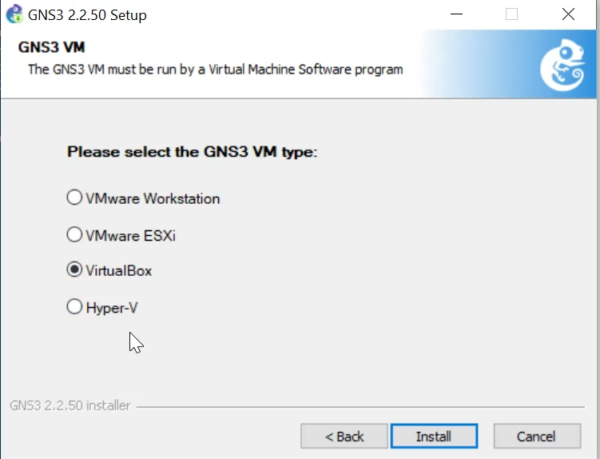
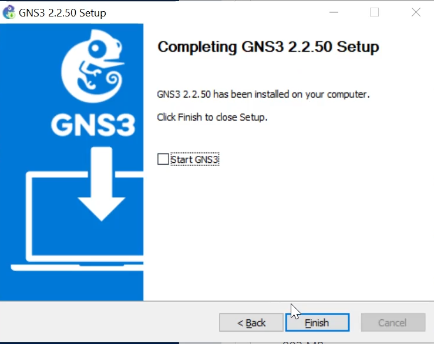
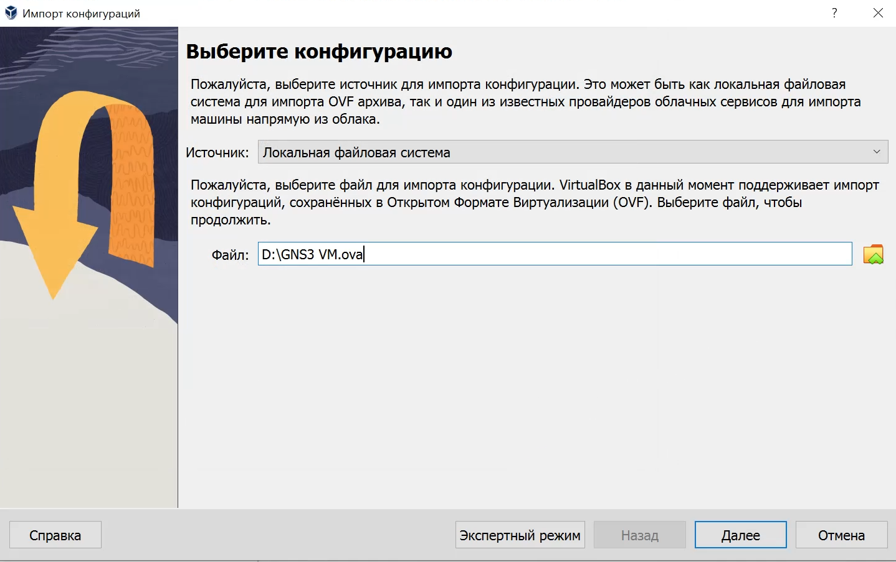
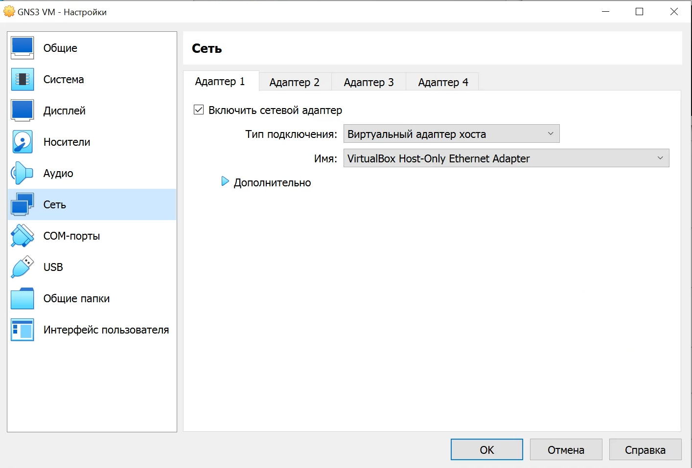
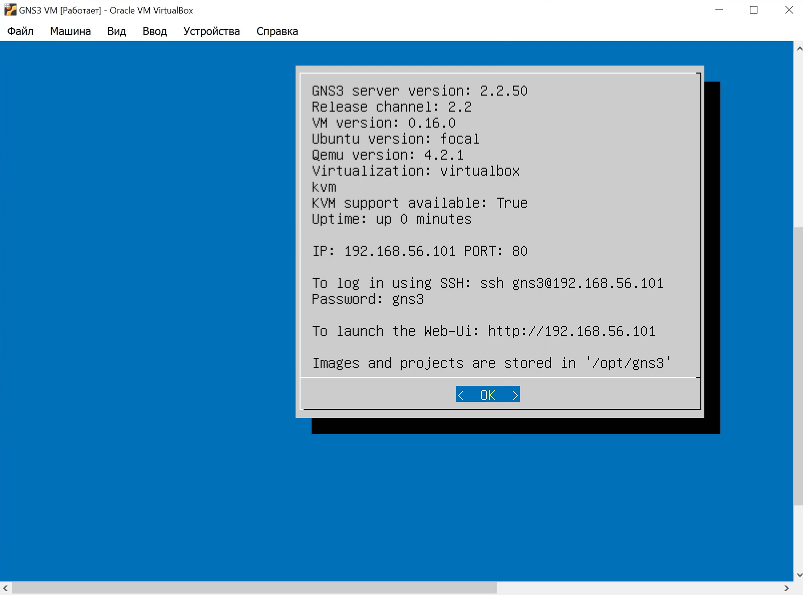
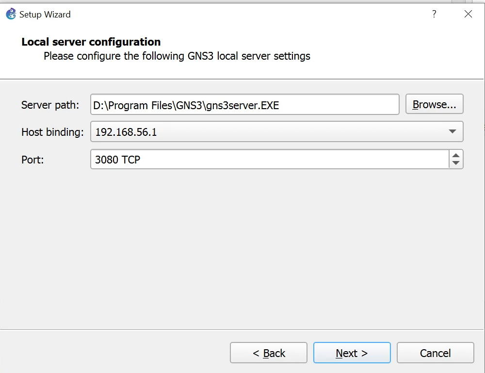
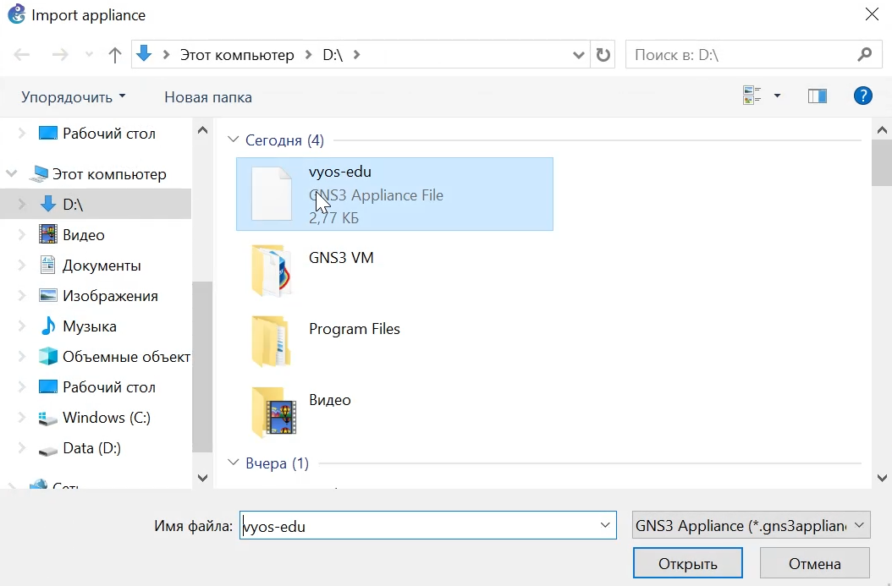
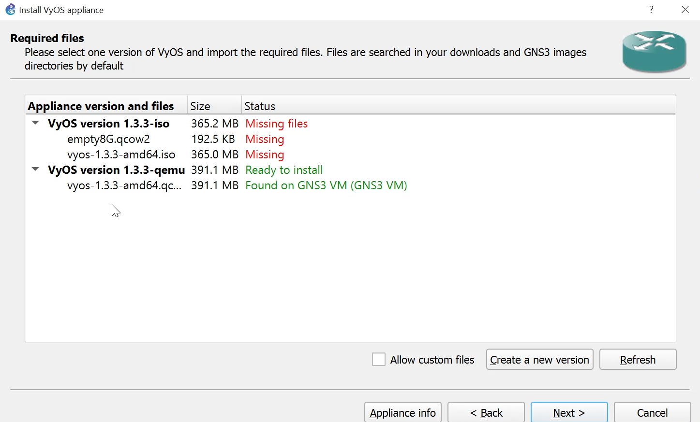

---
## Front matter
title: "Отчёт по лабораторной работе №4"
subtitle: "Сетевые технологии"
author: "Ищенко Ирина НПИбд-02-22"

## Generic otions
lang: ru-RU
toc-title: "Содержание"

## Bibliography
bibliography: bib/cite.bib
csl: pandoc/csl/gost-r-7-0-5-2008-numeric.csl

## Pdf output format
toc: true # Table of contents
toc-depth: 2
lof: true # List of figures
lot: true # List of tables
fontsize: 12pt
linestretch: 1.5
papersize: a4
documentclass: scrreprt
## I18n polyglossia
polyglossia-lang:
  name: russian
  options:
	- spelling=modern
	- babelshorthands=true
polyglossia-otherlangs:
  name: english
## I18n babel
babel-lang: russian
babel-otherlangs: english
## Fonts
mainfont: IBM Plex Serif
romanfont: IBM Plex Serif
sansfont: IBM Plex Sans
monofont: IBM Plex Mono
mathfont: STIX Two Math
mainfontoptions: Ligatures=Common,Ligatures=TeX,Scale=0.94
romanfontoptions: Ligatures=Common,Ligatures=TeX,Scale=0.94
sansfontoptions: Ligatures=Common,Ligatures=TeX,Scale=MatchLowercase,Scale=0.94
monofontoptions: Scale=MatchLowercase,Scale=0.94,FakeStretch=0.9
mathfontoptions:
## Biblatex
biblatex: true
biblio-style: "gost-numeric"
biblatexoptions:
  - parentracker=true
  - backend=biber
  - hyperref=auto
  - language=auto
  - autolang=other*
  - citestyle=gost-numeric
## Pandoc-crossref LaTeX customization
figureTitle: "Рис."
tableTitle: "Таблица"
listingTitle: "Листинг"
lofTitle: "Список иллюстраций"
lotTitle: "Список таблиц"
lolTitle: "Листинги"
## Misc options
indent: true
header-includes:
  - \usepackage{indentfirst}
  - \usepackage{float} # keep figures where there are in the text
  - \floatplacement{figure}{H} # keep figures where there are in the text
---

# Цель работы

Установка и настройка GNS3 и сопутствующего программного обеспечения.

# Выполнение лабораторной работы

Устанавливаем GNS3 с помощью менеджера пакетов Chocolatey (рис. [-@fig:1]). После запуска графического окна по установке следуем указаниям, нажимая **Next**, принимая соглашение по лицензии, выбирая отображение названия каталога в стартовом меню.
В процессе установки при выборе комплектации отмечаем MSVC Runtime (отмечено по умолчанию), GNS3-Desktop, GNS3-VM, Tools (рис. [-@fig:2]). Выбираем тип ВМ VirtualBox (рис. [-@fig:3]).

{#fig:1 width=70%}

{#fig:2 width=70%}

{#fig:3 width=70%}

Далее следуем инструкциям установщика, нажимая **Next**. Дожидаемся установки GNS3 и пакетов, принимаем соглашение по лицензии и завершаем установку  (рис. [-@fig:4]).

{#fig:4 width=70%}

Скачиваем архив с образом виртуальной машины GNS3 VM с официального сайта, распаковываем его. Запустив VirtualBox, выбираем *Файл* -> *Импорт конфигураций*. Указываем месторасположение распакованного образа `GNS3 VM.ova` (рис. [-@fig:5]). В следующем окне в параметрах импорта выбираем в политике MAC-адреса «Сгенерировать новые MAC-адреса всех сетевых адаптеров» и дожидаемся конца импорта (рис. [-@fig:6]). 

{#fig:5 width=70%}

{#fig:6 width=70%}

Переходим к настройке ВМ. Для этого в VirtualBox выбираем импортированную виртуальную машину и переходим в меню *Машина* -> *Настроить*. Следуем рекомендациям из сообщения об обнаружении неправильных настроек и исправляем ошибки. Проверяем минимальные ресурсы (2048 МБ основной памяти, 2 процессора). Настраиваем вложенную виртуализацию в опции *Система*, вкладка *Процессор*. В графическом интерфейсе  отмечаем флажок *Включить Nested VT-x/AMD-V* (рис. [-@fig:7]).

{#fig:7 width=70%}

Настраиваем сетевой адаптер, убедившись, что выбран режим *Виртуальный адаптер хоста* (рис. [-@fig:8]).

{#fig:8 width=70%}

Запускаем виртуальную машину GNS3 VM (рис. [-@fig:9]).

{#fig:9 width=80%}

Запускаем приложение GNS3 и в мастере настройки выбираем способ работы (рис. [-@fig:10]), настройки локального сервера. Выбираем IP-адрес привязки хоста (рис. [-@fig:11]). После успешного подсоединения появляется окно с итоговыми настройками (рис. [-@fig:12]). В списке серверов видим GNS3 VM.

{#fig:10 width=80%}

{#fig:11 width=80%}

{#fig:12 width=80%}

Для выключения GNS3 используем *File* -> *Quit*. Выключается также виртуальная машина.

В рабочем пространстве GNS3 на левой боковой панели выбираем просмотр маршрутизаторов, затем нажимаем *+ New template*. В открывшемся окне указываем установку образа с GNS3-сервера, нажимаем  *Next*, оставляем эмулятор по умолчанию. Далее в списке роутеров выбираем FRR (рис. [-@fig:13]) и нажимаем *Install*. Скачиваем и импортируем необходимые файлы (рис. [-@fig:14]), завершаем установку (рис. [-@fig:15]).

{#fig:13 width=70%}

{#fig:14 width=70%}

{#fig:15 width=70%}

Для настройки образа щелкаем правой кнопкой на образе и выбираю *Configure template*. В открывшемся окне во вкладке *General settings* в поле *On close* выбираем *Send the shutdown signal (ACPI)* (рис. [-@fig:16]). Во вкладке *HDD* ставим галочку *Automatically create a config disk on HDD* (рис. [-@fig:17]).

{#fig:16 width=70%}

{#fig:17 width=70%}

Скачав установочный файл VyOS (рис. [-@fig:18]), переходим в *File* -> *Import appliance* и импортируем его (рис. [-@fig:19]). Далее производим аналогичные настройке FRR шаги, скачиваем необходимые файлы и импортирем их, завершаем установку  (рис. [-@fig:20])

{#fig:18 width=70%}

{#fig:19 width=70%}

{#fig:20 width=70%}

Для настройки образа маршрутизатора VyOS щелкаем правой кнопкой на образе и выбираю *Configure template*. В открывшемся окне во вкладке *General settings* в поле *On close* выбираем *Send the shutdown signal (ACPI)*. Во вкладке *HDD* ставим галочку *Automatically create a config disk on HDD*. Также изменем отображаемый символ устройства, перейдя в *General settings* -> *Symbol*. В рабочем пространстве GNS3 теперь отображаются два разных образа маршрутизаторов рис. ([-@fig:21]).

{#fig:21 width=70%}

# Выводы

В ходе лабораторной работы я установила и настроила GNS3 и сопутствующего программного обеспечения.
