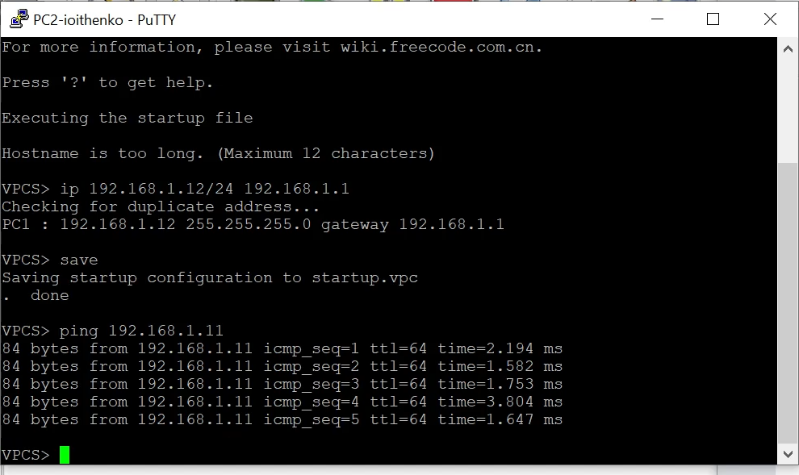
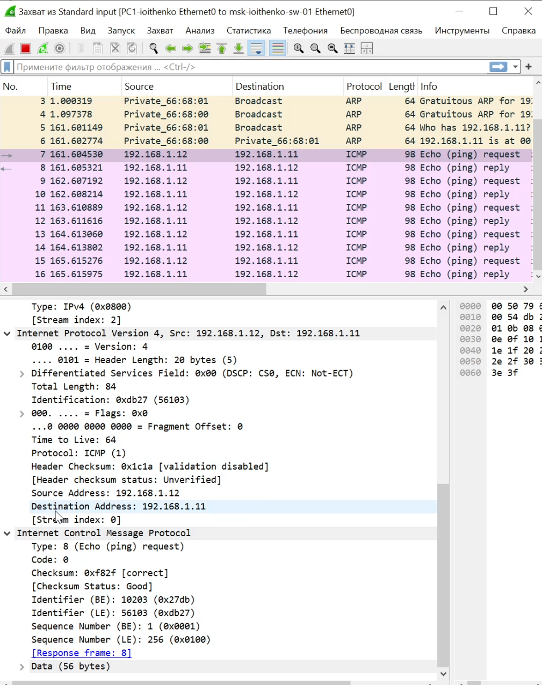
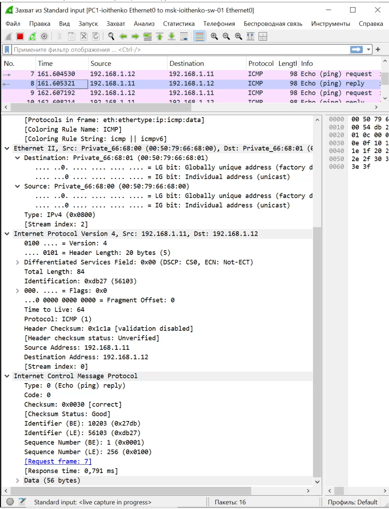
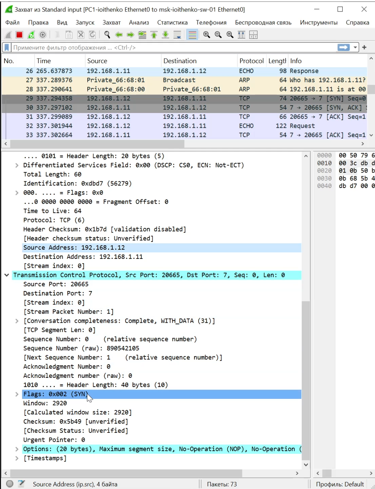
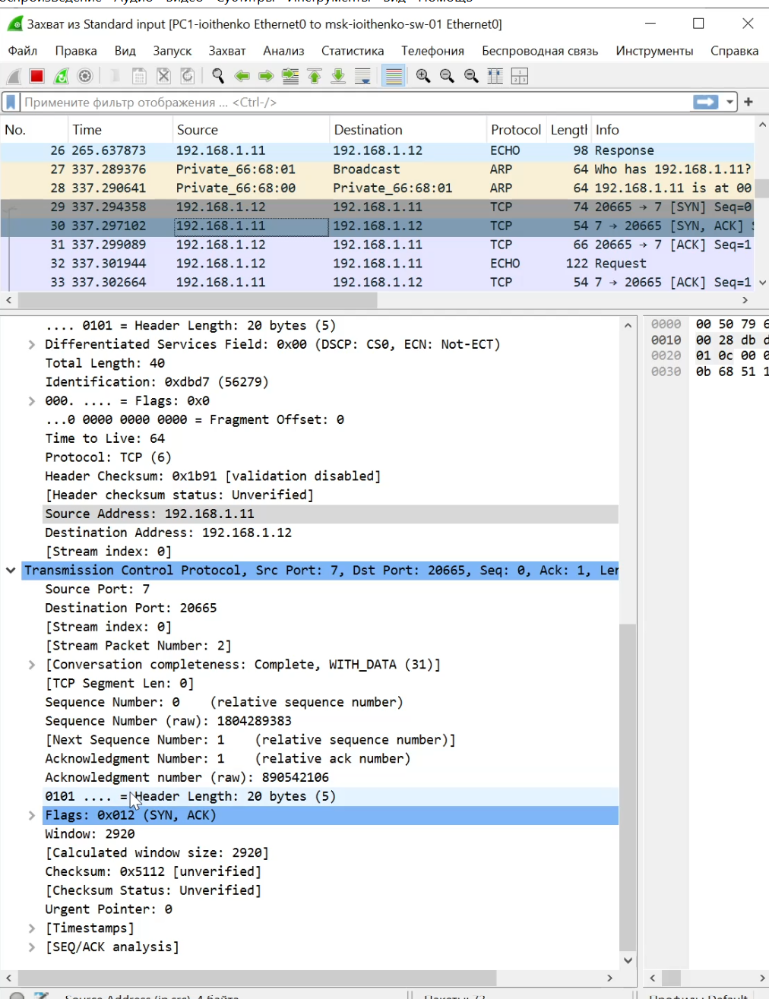
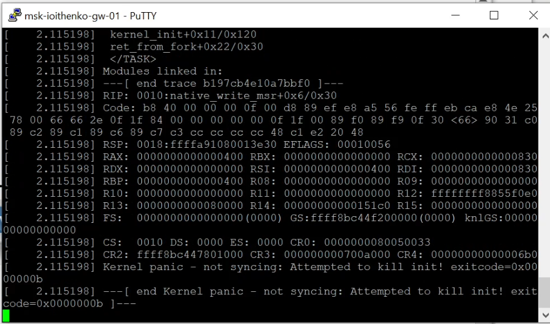
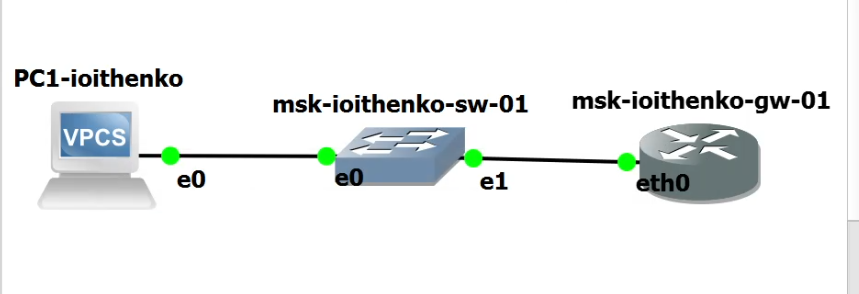
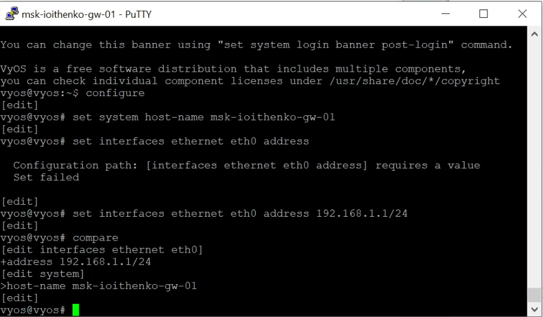
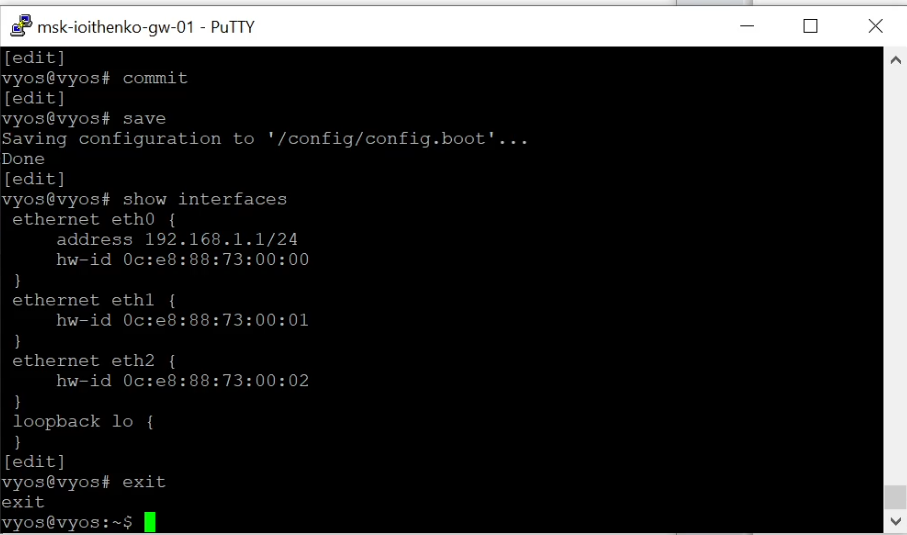
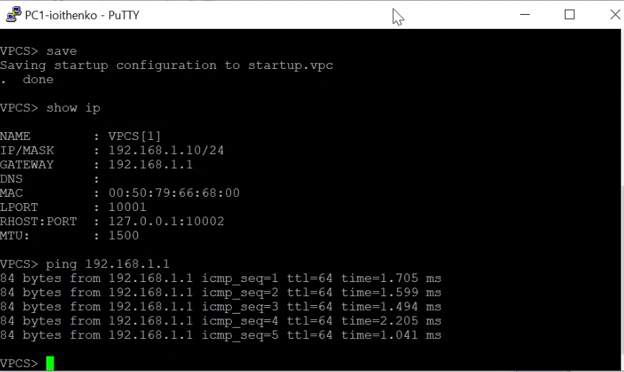

---
## Front matter
title: "Отчёт по лабораторной работе №5"
subtitle: "Сетевые технологии"
author: "Ищенко Ирина НПИбд-02-22"

## Generic otions
lang: ru-RU
toc-title: "Содержание"

## Bibliography
bibliography: bib/cite.bib
csl: pandoc/csl/gost-r-7-0-5-2008-numeric.csl

## Pdf output format
toc: true # Table of contents
toc-depth: 2
lof: true # List of figures
lot: true # List of tables
fontsize: 12pt
linestretch: 1.5
papersize: a4
documentclass: scrreprt
## I18n polyglossia
polyglossia-lang:
  name: russian
  options:
	- spelling=modern
	- babelshorthands=true
polyglossia-otherlangs:
  name: english
## I18n babel
babel-lang: russian
babel-otherlangs: english
## Fonts
mainfont: IBM Plex Serif
romanfont: IBM Plex Serif
sansfont: IBM Plex Sans
monofont: IBM Plex Mono
mathfont: STIX Two Math
mainfontoptions: Ligatures=Common,Ligatures=TeX,Scale=0.94
romanfontoptions: Ligatures=Common,Ligatures=TeX,Scale=0.94
sansfontoptions: Ligatures=Common,Ligatures=TeX,Scale=MatchLowercase,Scale=0.94
monofontoptions: Scale=MatchLowercase,Scale=0.94,FakeStretch=0.9
mathfontoptions:
## Biblatex
biblatex: true
biblio-style: "gost-numeric"
biblatexoptions:
  - parentracker=true
  - backend=biber
  - hyperref=auto
  - language=auto
  - autolang=other*
  - citestyle=gost-numeric
## Pandoc-crossref LaTeX customization
figureTitle: "Рис."
tableTitle: "Таблица"
listingTitle: "Листинг"
lofTitle: "Список иллюстраций"
lotTitle: "Список таблиц"
lolTitle: "Листинги"
## Misc options
indent: true
header-includes:
  - \usepackage{indentfirst}
  - \usepackage{float} # keep figures where there are in the text
  - \floatplacement{figure}{H} # keep figures where there are in the text
---

# Цель работы

Построить простейшие модели сетей на базе коммутатора и маршрутизаторов FRR и VyOS в GNS3, проанализировать трафик посредством Wireshark.

# Выполнение лабораторной работы

Для начала запустим GNS3 VM и GNS3, а также создадим новый проект.
В рабочей области GNS3 разместим коммутатор Ethernet и два VPCS. В меню Configure изменим название устройства, включив в имя устройства имя моей учётной записи. Коммутатору присвоим название msk-ioithenko-sw-01. Соединим VPCS с коммутатором и отобразим обозначение интерфейсов соединения (рис. @fig:001).
 
{#fig:001 width=70%}

Зададим IP-адреса VPCS. Для этого с помощью меню, вызываемого правой кнопкой мыши, запустим Start PC-1, затем вызовем его терминал Console. Для просмотра синтаксиса возможных для ввода команд можно набрать /?.
Для задания IP-адреса 192.168.1.11 в сети 192.168.1.0/24 введем: 
ip 192.168.1.11/24 192.168.1.1 
Для сохранения конфигурации введем команду save (рис. @fig:002).
 
{#fig:002 width=70%}

Аналогичным образом зададим IP-адрес 192.168.1.12 для PC-2. Пингуем соответственно IP-адрес PC-1. Получаем эхо-ответ от PC-1. Значит соединение наших PC работоспособно (рис. @fig:003).
 
{#fig:003 width=70%}

Проверим работоспособность соединения между PC-1 и PC-2 с помощью команды ping.
В терминале PC-1 введем команду ping и IP-адрес, присвоенный PC-2. Получаем эхо-ответ от PC-2 (возвращены 5 пакетов) (рис. @fig:004). 
 
{#fig:004 width=70%}

Остановим в проекте все узлы (рис. @fig:005).
 
{#fig:005 width=70%}

Запустим на соединении между PC-1 и коммутатором анализатор трафика. Для этого щёлкнем правой кнопкой мыши на соединении, выберем в меню Start capture. После этого запустился Wireshark, а в проекте GNS3 на соединении появился значок лупы.В проекте GNS3 стартуем все узлы (рис. @fig:006). 
 
{#fig:006 width=70%}

В окне Wireshark отобразится информация по протоколу ARP (рис. @fig:007).
В поле кадра физического уровня мы можем узнать длину кадра (в моем случае было 64 бита). В поле канального уровня можем посмотреть mac-адреса источника и получателя. По  нулевому и первому битам можем определить тип mac-адресов (получатель – локально администрируемый и широковещательный; источник - глобально администрируемый и индивидуальный). 
 
{#fig:007 width=70%}

В терминале PC-2 посмотрим информацию по опциям команды ping. Затем сделаем один эхо-запрос в ICMP-моде к узлу PC-1. Для этого используем опцию -1 (рис. @fig:008).
 
{#fig:008 width=70%}

Далее откроем Wireshark и проанализируем эхо-запрос по протоколу ICMP (рис. @fig:009) и (рис. @fig:0010). В поле канального уровня можем посмотреть mac-адреса источника и получателя. По нулевому и первому битам можем определить тип mac-адресов (получатель и источник - глобально администрируемые и одиночные, так как биты равны 0). В поле сетевого уровня указан протокол ICMP и IP-адреса источника (192.168.1.12, то есть PC-2) и получателя (192.168.1.11, то есть PC-2).
 
{#fig:009 width=70%}
 
{#fig:0010 width=70%}

Сделаем один эхо-запрос в UDP-моде к узлу PC-1. Для этого используем опцию -2 (рис. @fig:0011).
 
{#fig:0011 width=70%}

Далее откроем Wireshark и проанализируем эхо-запрос по протоколу UDP (рис. @fig:0012) и (рис. @fig:0013). В поле канального уровня можем посмотреть mac-адреса источника и получателя. По нулевому и первому битам можем определить тип mac-адресов (получатель и источник - глобально администрируемые и одиночные, так как биты равны 0). В поле сетевого уровня указан протокол UDP и IP-адреса источника (192.168.1.12, то есть PC-2) и получателя (192.168.1.11, то есть PC-2). В поле протокола UDP указаны порты источника (17622) и получателя (7).
 
{#fig:0012 width=70%}

{#fig:0013 width=70%}

Сделаем один эхо-запрос в TCP-моде к узлу PC-1. Для этого используем опцию -3 (рис. @fig:0014).
 
{#fig:0014 width=70%}

Далее откроем Wireshark и проанализируем эхо-запрос по протоколу TCP. В поле канального уровня можем посмотреть mac-адреса источника и получателя. По нулевому и первому битам можем определить тип mac-адресов (получатель и источник - глобально администрируемые и одиночные, так как биты равны 0). В поле сетевого уровня указан протокол TCP и IP-адреса источника (192.168.1.12, то есть PC-2) и получателя (192.168.1.11, то есть PC-2).

В поле протокола TCP можем узнать порты источника (20665) и получателя (7). А также посмотреть, как работает handshake протокола TCP. На первом шаге установлен флаг SYN (рис. @fig:0015), а также Порядковому номеру (Sequence Number) присвоено начальное 32-битное значение ISSa (в нашем случае 890542105). 
 
{#fig:0015 width=70%}
 
На втором шаге установлены флаги SYN и ACK (рис. @fig:0016).
 
{#fig:0016 width=70%}

На третьем шаге установлен флаг ACK (рис. @fig:0017).

{#fig:0017 width=70%}

Теперь можно остановить захват трафика в Wireshark.

Теперь нам нужно построить в GNS3 топологию сети (рис. @fig:0018), состоящей из маршрутизатора FRR, коммутатора Ethernet и оконечного устройства.
 
{#fig:0018 width=70%}

К сожалению, у меня возникают проблемы после запуска терминала маршрутизатора FRR, и нет возможности вводить команды (рис. @fig:0019). Ошибка: kernel panic.
 
{#fig:0019 width=70%}

В рабочей области GNS3 разместим VPCS, коммутатор Ethernet и маршрутизатор VyOS.
Изменим отображаемые названия устройств. Коммутатору присвоим название msk-ioithenko-sw-01, маршрутизатору — по принципу msk-ioithenko-gw-01, VPCS — по принципу PC1-ioithenko.
Включим захват трафика на соединении между коммутатором и маршрутизатором (рис. @fig:0020) (появится значок лупы).
Запустим все устройства проекта и откроем консоль всех устройств проекта.
 
{#fig:0020 width=70%}

Откроем окно терминала PC-1 и настроим IP-адресацию для интерфейса этого узла (рис. @fig:0021).
 
{#fig:0021 width=70%}

Настроим маршрутизатор VyOS (рис. @fig:0022):
Во-первых, после загрузки нужно ввести логин vyos и пароль vyos.
В рабочем режиме в командной строке отобразится символ $.
Далее надо установить систему на диск с помощью команды install image, но у меня эта система уже была.

{#fig:0022 width=70%}

Следующим шагом перейдем в режим конфигурирования с помощью команды configure. Изменим имя устройства командой set system host-name msk-ioithenko-gw-01
Зададим IP-адрес на интерфейсе eth0 командой set interfaces ethernet eth0 address 192.168.1.1/24
Посмотрим внесённые в конфигурацию изменения с помощью команды compare (рис. @fig:0023).
 
{#fig:0023 width=70%}

Далее применим изменения в конфигурации и сохраним саму конфигурацию с помощью команд commit и save (рис. @fig:0024).

{#fig:0024 width=70%}

Посмотрим информацию об интерфейсах маршрутизатора с помощью команды show interfaces (рис. @fig:0025).
Выйдем из режима конфигурирования, используя команду exit.
 
{#fig:0025 width=70%}

Теперь проверим подключение. Узел PC1 должен успешно отправлять эхо-запросы на адрес маршрутизатора 192.168.1.1. Для проверки пингуем маршрутизатор (рис. @fig:0026). Получили эхо-ответ (4 пакета).
 
{#fig:0026 width=70%}

В окне Wireshark проанализируем полученную информацию (рис. @fig:0027). В поле канального уровня можем посмотреть mac-адреса источника и получателя. По нулевому и первому битам можем определить тип mac-адресов (получатель и источник - глобально администрируемые и одиночные, так как биты равны 0). В поле сетевого уровня указан протокол ICMP и IP-адреса источника (192.168.1.10, то есть PC-1) и получателя (192.168.1.1, то есть маршрутизатор VyOS). 
 
{#fig:0027 width=70%}

# Выводы
 
В процессе выполнения лабораторной работы я построила простейшие модели сети на базе коммутатора и маршрутизатора VyOS в GNS3, проанализировала трафик посредством Wireshark.

