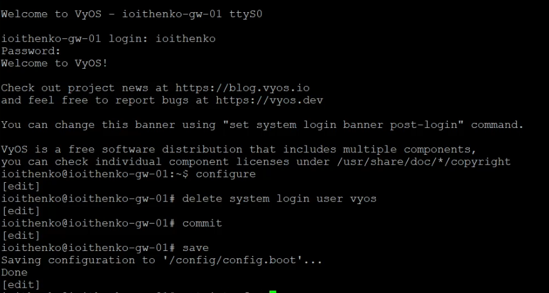

---
## Front matter
title: "Отчёт по лабораторной работе №7"
subtitle: "Сетевые технологии"
author: "Ищенко Ирина НПИбд-02-22"

## Generic otions
lang: ru-RU
toc-title: "Содержание"

## Bibliography
bibliography: bib/cite.bib
csl: pandoc/csl/gost-r-7-0-5-2008-numeric.csl

## Pdf output format
toc: true # Table of contents
toc-depth: 2
lof: true # List of figures
lot: true # List of tables
fontsize: 12pt
linestretch: 1.5
papersize: a4
documentclass: scrreprt
## I18n polyglossia
polyglossia-lang:
  name: russian
  options:
	- spelling=modern
	- babelshorthands=true
polyglossia-otherlangs:
  name: english
## I18n babel
babel-lang: russian
babel-otherlangs: english
## Fonts
mainfont: IBM Plex Serif
romanfont: IBM Plex Serif
sansfont: IBM Plex Sans
monofont: IBM Plex Mono
mathfont: STIX Two Math
mainfontoptions: Ligatures=Common,Ligatures=TeX,Scale=0.94
romanfontoptions: Ligatures=Common,Ligatures=TeX,Scale=0.94
sansfontoptions: Ligatures=Common,Ligatures=TeX,Scale=MatchLowercase,Scale=0.94
monofontoptions: Scale=MatchLowercase,Scale=0.94,FakeStretch=0.9
mathfontoptions:
## Biblatex
biblatex: true
biblio-style: "gost-numeric"
biblatexoptions:
  - parentracker=true
  - backend=biber
  - hyperref=auto
  - language=auto
  - autolang=other*
  - citestyle=gost-numeric
## Pandoc-crossref LaTeX customization
figureTitle: "Рис."
tableTitle: "Таблица"
listingTitle: "Листинг"
lofTitle: "Список иллюстраций"
lotTitle: "Список таблиц"
lolTitle: "Листинги"
## Misc options
indent: true
header-includes:
  - \usepackage{indentfirst}
  - \usepackage{float} # keep figures where there are in the text
  - \floatplacement{figure}{H} # keep figures where there are in the text
---

# Цель работы

Получение навыков настройки службы DHCP на сетевом оборудовании для распределения адресов IPv4 и IPv6.

# Выполнение лабораторной работы

Запускаю GNS3 VM и GNS3. Создаю новый проект. В рабочей области GNS3 размещаю коммутатор Ethernet, маршрутизатор VyOS и хост VPCS. Формирую топологию сети согласно инструкции и таблице адресации. Включаю захват трафика между коммутатором и маршрутизатором. Включаю все устройства сети (рис. [-@fig:1]).

{#fig:1 width=70%}

Перехожу к настройке маршрутизатора. Изменяю имя устройства, доменное имя, системного пользователя (рис. [-@fig:2]).

{#fig:2 width=70%}

Удаляю пользователя по умолчанию (рис. [-@fig:3]).

{#fig:3 width=70%}

Настраиваю IPv4-адресацию и конфигурацию DHCP-сервера  на `msk-ioithenko-gw-01`   (рис. [-@fig:4]). 

{#fig:4 width=70%}

Здесь при помощи указанных выше команд была создана разделяемая сеть
(`shared-network-name`) с названием `ioithenko`, подсеть (`subnet`) с адресом
`10.0.0.0/24`, задан диапазон адресов (`range`) с именем `hosts`, содержащий адреса `10.0.0.2 – 10.0.0.253`.

Настраиваю РС1 и проверяю конфигурацию (рис. [-@fig:5]). Для устройства был выдан адрес `10.0.0.2/24`.

{#fig:5 width=70%}

Использую команды для просмотра статистики DHCP-сервера и выданных адресов и вижу в списке выданный адрес для РС1 (рис. [-@fig:6]). Также просматриваю журнал работы DHCP (рис. [-@fig:7]).

{#fig:6 width=70%}

{#fig:7 width=70%}

Просматриваю захваченные анализатором трафика пакеты (рис. [-@fig:8] и [-@fig:9]).

{#fig:8 width=80%}

{#fig:9 width=80%}

Процессе получения устройством адреса по протоколу DHCP происходит в 4 шага:

- «DHCP DISCOVER»: устройство отправляет широковещательный запрос, в котором во фрейме (PDU канального уровня) в поле адреса отправителя указывается MAC-адрес устройства, а в поле адреса получателя — широковещательный адрес ffff.ffff.ffff; в пакете (PDU сетевого 
уровня) в поле адреса отправителя указан адрес 0.0.0.0, а в поле адреса получателя — адрес 255.255.255.255; 

- «DHCP OFFER»: DHCP-сервер после получения широковещательного сообщения выделяет (но не резервирует) в своём пуле адресов некоторый адрес DHCP-клиенту на заданное время (lease time), назначает другие настройки (опции) и пересылает всю информацию DHCP клиенту; при этом в соответствующих полях получателя в сообщении указываются выделенный клиенту IP-адрес и его MAC-адрес. В нашем случае адрес отправителя – 10.0.0.1 – адрес DHCP-сервера, а адрес получателя 10.0.0.2.

- «DHCP REQUEST»: клиент отправляет DHCP-серверу согласие с полученными параметрами; 

- «DHCP ACKNOWLEDGE»: DHCP-сервер резервирует за DHCP-клиентом выделенный адрес на какое-то время (lease time), вносит информацию в свою ARP-таблицу и высылает DHCP-клиенту сообщение об успешной регистрации адреса.

Дополняю предыдущую сеть в соответствии с топологией из инструкции. Использую хост Kali Linux 2019 (использовать Kali Linux CLI не получилось, так как воспринимались не все необходимые команды) (рис. [-@fig:10]). Включаю захват трафика на соединениях между маршрутизатором `gw-01` и коммутаторами `sw-02` и `sw-03`.

{#fig:10 width=70%}

Настраиваю IPv6-адресацию на маршрутизаторе (рис. [-@fig:11]).

{#fig:11 width=70%}

На маршрутизаторе настраиваю DHCPv6 без отслеживания состояния (DHCPv6
Stateless configuration) (рис. [-@fig:12]).

{#fig:12 width=70%}

Здесь с помощью указанных выше команд создана разделяемая сеть (`shared-network-name`) с названием `ioithenko-stateless`, задана информация общих опций (`common-options`) для разделяемой сети. При этом подсеть (`subnet`) `2000::/64` не требуется настраивать, поскольку она не будет содержать полезной информации.

Проверяю настройки сети на РС2, пробую пропинговать маршрутизатор (успешно), проверяю настройки DNS (рис. [-@fig:13] и [-@fig:14]). 

{#fig:13 width=70%}

{#fig:14 width=70%}

Получаю адрес по DHCPv6 с помощью `dhclient -6 -S -v eth0`. Вновь пингую маршрутизатор (успешно), проверяю настройки DNS (рис. [-@fig:15]). 

{#fig:15 width=70%}

Использую команды для просмотра статистики DHCP-сервера и выданных адресов, но список пока пуст, хотя адрес был выдан (рис. [-@fig:16]). С маршрутизатора РС1 пингуется успешно.

{#fig:16 width=70%}

Просматриваю захваченные анализатором трафика пакеты (рис. [-@fig:17] и [-@fig:18]).

{#fig:17 width=70%}

{#fig:18 width=70%}

Процесс получения адреса по DHCPv6 без отслеживания состояния происходит в 2 шага:

- INFORMATION-REQUEST: используется 
клиентом для запроса только параметров конфигурации (например, адреса 
DNS-сервера). 

- REPLY: используется DHCPv6-сервером для отправки 
клиенту сетевых настроек и завершения обработки запроса. 

На маршрутизаторе настраиваю DHCPv6 с отслеживанием состояния (DHCPv6
Stateful configuration) (рис. [-@fig:19]).

{#fig:19 width=70%}

Здесь при помощи указанных выше команд создана разделяемая сеть
(`shared-network-name`) с названием `ioithenko-stateful`, подсеть (`subnet`) с адресом `2001::/64`, задан диапазон адресов (`range`) с именем `hosts`, содержащий адреса `2001::100 – 2001::199`.

На РС3 проверяю настройки сети и DNS (рис. [-@fig:20] и [-@fig:21]).

{#fig:20 width=70%}

{#fig:21 width=70%}

Получаю адрес по DHCPv6 (рис. [-@fig:22]).

{#fig:22 width=70%}

Вновь на РС3 проверяю настройки сети и DNS, пингую маршрутизатор (успешно) (рис. [-@fig:23], [-@fig:24] и [-@fig:25]).

{#fig:23 width=70%}

{#fig:24 width=70%}

{#fig:25 width=70%}

Использую команды для просмотра статистики DHCP-сервера и выданных адресов на маршрутизаторе и убеждаюсь, что адрес был выдан (рис. [-@fig:26]).

{#fig:26 width=70%}

Просматриваю захваченные анализатором трафика пакеты (рис. [-@fig:27]).

{#fig:27 width=70%}

Процесс получения устройством адреса по DHCPv6 с отслеживанием состояния происходит в 4 шага: 

- SOLICIT: устройство направляет на зарезервированный IPv6-адрес многоадресной рассылки FF02::1:2 широковещательный запрос; 

- ADVERTISE: DHCPv6-сервер сообщает DHCPv6-клиенту, что сервер доступен для предоставления службы DHCPv6; 

- REQUEST: используется клиентом для запроса IPv6-адреса и всех остальных параметров конфигурации от сервера в случае, когда DHCPv6-сервер работает с сохранением состояния; 

-  REPLY: используется DHCPv6-сервером для отправки клиенту сетевых настроек и завершения обработки запроса. 

# Выводы

В ходе выполнения лабораторной работы я получила навыки настройки службы DHCP на сетевом оборудовании для распределения адресов IPv4 и IPv6.

